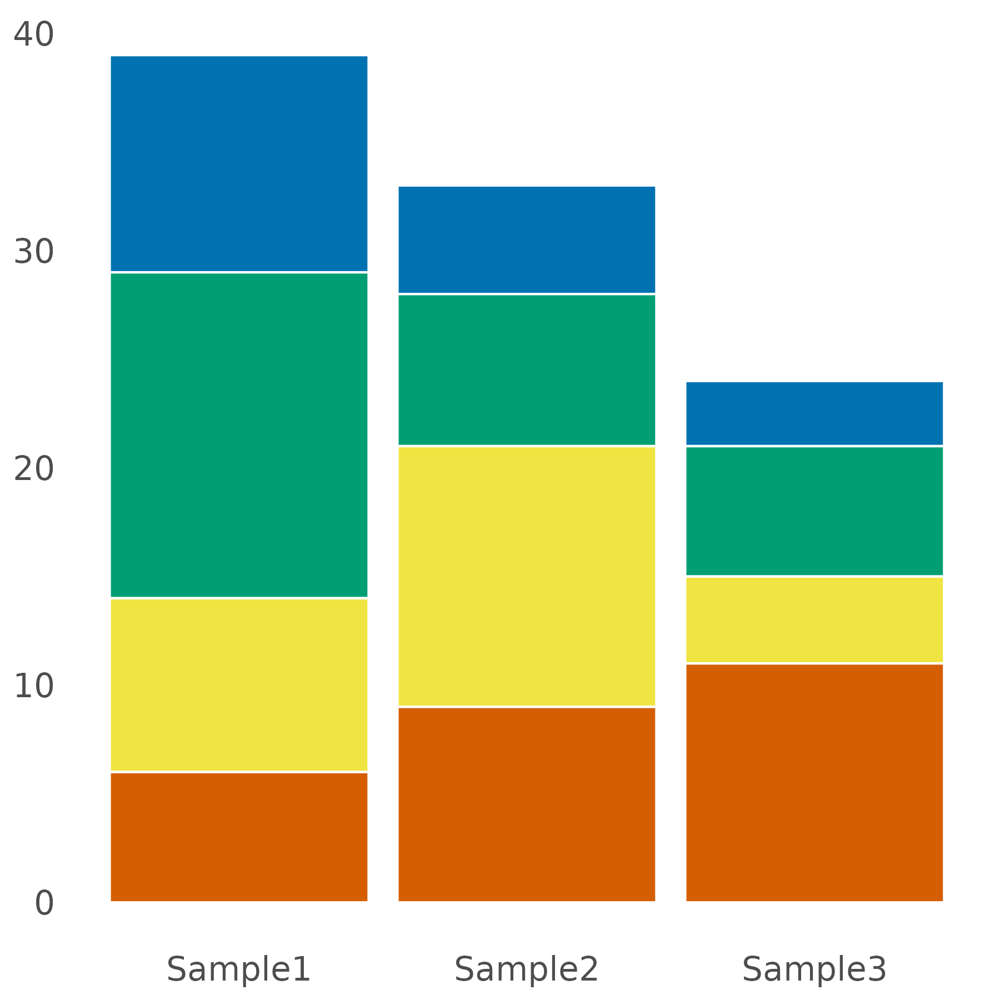

## CellOmicsR

CellOmicsR is a comprehensive and versatile software package designed for bioinformatics research and analysis. It provides a wide range of functions to facilitate the visualization of biological data.


## Plot Graph Network


## Bar plot




## Install

``` r
install.packages("devtools")
devtools::install_github("L7991-lian/CellOmicsR")
```

## Tutorial

[Tutorial for CellOmicsR](https://rpubs.com/JinlianLi2020/bioinformatics)


## Help and Suggestion

If you have any question, comment or suggestion, please use github issue tracker to report issues.
